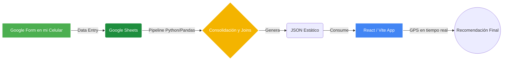

# 🍦 Helado Finder CABA — Mi Bitácora y Recomendador

> *"Estando en cualquier punto de Buenos Aires, ¿a qué heladería voy minimizando la caminata pero maximizando la calidad según mi antojo del día?"*

**Helado Finder CABA** es un proyecto personal de **Data Engineering y Analytics** creado por **Sebi**. 
Nace de una necesidad real: optimizar la decisión de dónde tomar helado basándome en una **bitácora histórica personal** alimentada en vivo. 

Este repositorio contiene un flujo de datos End-to-End pragmático, de latencia cero y costos $0, diseñado específicamente como proyecto de portfolio.

---

## 🔬 La Hipótesis y el Modelo Matemático

El recomendador no utiliza opiniones de terceros (como Google Maps), sino que se basa exclusivamente en mi propio paladar.
Asume que la salida perfecta es un equilibrio entre **Calidad** y **Fricción (Caminata)**.

Cuando abro la aplicación, el algoritmo calcula en vivo un **Blend Score** para cada heladería en un radio determinado, utilizando la siguiente fórmula:

```text
Score Final = (Puntaje_Histórico * 0.7) + (Proximidad * 0.3)
```

1. **Puntaje_Histórico (70%)**: Promedio de mis calificaciones para el antojo que seleccioné (ej. Chocolate), normalizado de 0 a 1.
2. **Proximidad (30%)**: Distancia lineal (fórmula de Haversine) entre el GPS de mi celular y la heladería, normalizada según mi tolerancia máxima a caminar.

---

## 🚀 Arquitectura del Proyecto (End-to-End)

El proyecto es un sistema de ingesta y consumo de datos hiper-pragmático que demuestra que no siempre se necesita una infraestructura compleja para resolver un problema de Data.



1. **Ingesta (Google Forms + Sheets)**: Cada vez que pruebo un helado, lleno un formulario en mi celular que impacta directo en mi "Data Warehouse" (Google Sheets).
2. **ETL (Python & Pandas)**: El script consolida las ocurrencias históricas con las heladerías y calcula el score promedio por categoría de antojo.
3. **Frontend Dashboard (Vite, React, TypeScript)**: Consume el JSON estático precalculado y realiza todo el filtrado geográfico y la recomendación matemática de manera reactiva local en mi navegador. También cuenta con un "Profile View" donde analizo mis hábitos de consumo de helado.

---

## 💻 Guía de Inicio Rápido en Local

### 1. Requisitos Previos
* **Node.js** (v18+)
* **Python** (3.10+)

### 2. Clonar e Instalar Frontend
```bash
npm install
```

### 3. Configurar Python (ETL Pipeline)
```bash
python3 -m venv venv
source venv/bin/activate  # macOS/Linux
pip install -r data_pipeline/requirements.txt
```

### 4. Generar Datos (Pipeline)
Ejecutar el script en modo "test" procesará los datos dummy locales para que puedas levantar la app:
```bash
python data_pipeline/process_data.py --mode test
```
*(Esto genera el archivo `public/data/heladerias_test.json` consolidando las visitas de prueba).*

### 5. Correr el Dashboard
```bash
npm run dev:test
```
La aplicación se cargará en `http://localhost:5173` consumiendo los datos generados y mostrándote el recomendador y mi bitácora analítica.

---

## ⚙️ Configuración para Producción (Deploy Automático)

Para conectar el pipeline con tu propio Google Sheet en GitHub Actions, necesitas configurar estos **Repository Secrets**:
1. `SPREADSHEET_ID`: El ID de tu Google Sheet (con las pestañas `HELADERIAS`, `CATEGORIAS`, `OCURRENCIAS`).
2. `GOOGLE_SERVICE_ACCOUNT_JSON`: Tu Service Account de GCP con permisos de lectura.

Cuando esto está seteado, cada deploy o cronjob de GitHub Actions ejecuta el script de Pandas en modo `prod`, actualiza el JSON y redespliega la web gratis en Vercel/Netlify.
